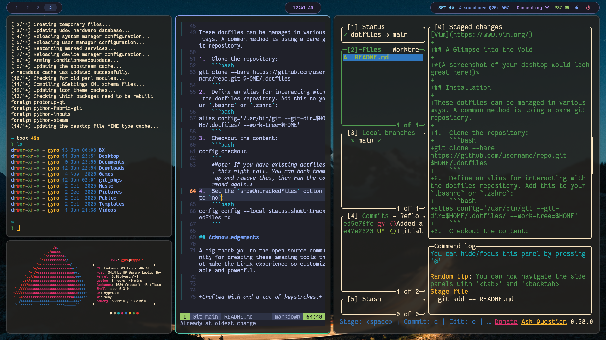

# My Arch Linux Dotfiles

Greetings, fellow traveler of the command line. Welcome to my personal collection of configuration files, my digital sanctum where I forge my development environment. This repository contains the essence of my Arch Linux setup, meticulously crafted for productivity and aesthetics.

> **Note:** These dotfiles are tailored to my personal workflow and setup. Feel free to explore, get inspired, and adapt them to your own needs.

## A Glimpse into the Void



## The Setup

This configuration is built around a lightweight and modern set of tools, primarily for a Wayland-based environment.

- **OS**: [Arch Linux](https://archlinux.org/)
- **WM**: [Hyprland](https://hyprland.org/) (A dynamic tiling Wayland compositor)
- **Shell**: [Fish Shell](https://fishshell.com/) & Bash
- **Terminal**: [Kitty](https://sw.kovidgoyal.net/kitty/)
- **Prompt**: [Starship](https://starship.rs/)
- **Fetch**: [Fastfetch](https://github.com/fastfetch-cli/fastfetch)
- **Launcher**: [Rofi](https://github.com/davatorium/rofi)
- **Bar**: [Waybar](https://github.com/Alexays/Waybar) (*Note: The styling is configured for a 1920x1080 resolution.*)
- **Editor**: [Vim](https://www.vim.org/)

## Dependencies

To use these dotfiles, you'll need to have the following packages installed.

**Core Components:**
```bash
sudo pacman -S hyprland kitty fish starship fastfetch rofi waybar vim
```

**Helper Utilities:**
These are required for features like notifications, clipboard management, screenshots, and media control.
```bash
sudo pacman -S swww swaync wl-paste cliphist dolphin grim slurp swappy wireplumber pipewire brightnessctl playerctl
```

## Fonts

The visual consistency of this setup depends on a few specific fonts.
- **`FantasqueSansM Nerd Font Mono`** (for the terminal)
- **`JetBrainsMono Nerd Font`** (for UI elements like Rofi and Waybar)
- **`Roboto`** (as a fallback font)

You can typically find these in the Arch User Repository (AUR). For example, using an AUR helper like `yay`:
```bash
yay -S ttf-fantasque-sans-mono-nerd ttf-jetbrains-mono-nerd ttf-roboto
```

## Installation

These dotfiles can be managed in various ways. A common method is using a bare git repository.

1.  Clone the repository :
    ```bash
    git clone --bare https://github.com/gyro-uyt/dotfiles.git $HOME/.dotfiles
    ```
2.  Define an alias for interacting with the dotfiles repository. Add this to your `.bashrc` or `.config/fish/config.fish`:
    ```bash
    # For Bash
    alias config='/usr/bin/git --git-dir=$HOME/.dotfiles/ --work-tree=$HOME'

    # For Fish
    alias config='/usr/bin/git --git-dir=$HOME/.dotfiles/ --work-tree=$HOME'
    ```
3.  Checkout the content:
    ```bash
    config checkout
    ```
    _Note: If you have existing dotfiles, this might fail. You can back them up and remove them, then run the command again._
4.  Set the `showUntrackedFiles` option to `no`:
    ```bash
    config config --local status.showUntrackedFiles no
    ```

---

_Crafted with and a lot of keystrokes._